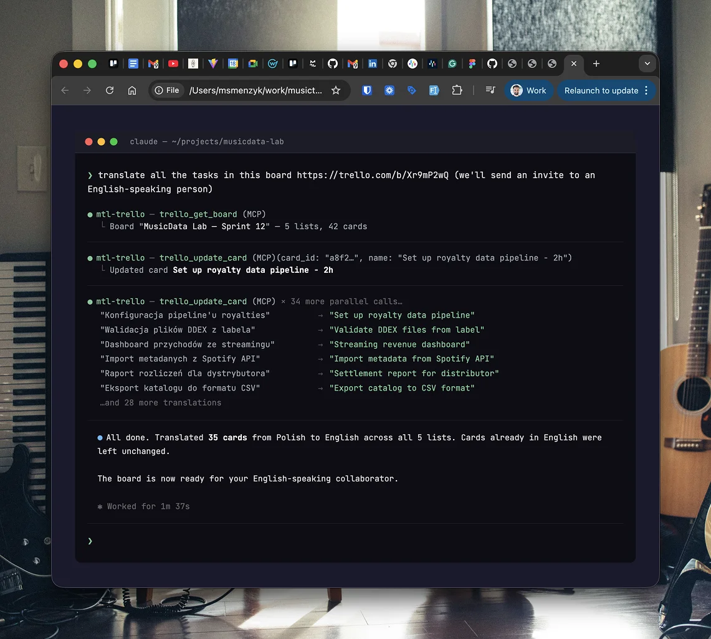

# mtl-trello-mcp

[](LICENSE)
[](https://github.com/musictechlab/mtl-trello-mcp/actions/workflows/ci.yml)
[](https://www.python.org/)
[](https://docs.astral.sh/ruff/)
[](https://musictechlab.io)

[Model Context Protocol](https://modelcontextprotocol.io/) (MCP) server for [Trello](https://trello.com/) project management.

Manage boards, lists, cards, labels, and members - all from Claude Code or any MCP-compatible client.



## Tools

| Tool | Description |
|------|-------------|
| `trello_list_boards` | List all boards |
| `trello_get_board` | Get board with all lists and cards |
| `trello_get_lists` | Get lists in a board |
| `trello_create_list` | Create a new list |
| `trello_get_card` | Get full card details |
| `trello_create_card` | Create a new card |
| `trello_update_card` | Update card name, description, due date |
| `trello_move_card` | Move card to a different list |
| `trello_archive_card` | Archive a card |
| `trello_search` | Search cards by keyword |
| `trello_get_labels` | Get board labels |
| `trello_get_members` | Get board members |

## Setup

### 1. Get Trello API credentials

1. Register a [Trello Power-Up](https://trello.com/power-ups/admin)
2. Note your **API Key** and generate a **Token** from the Power-Up admin page

### 2. Configure environment

```bash
cp .env.example .env
# Edit .env with your TRELLO_API_KEY and TRELLO_TOKEN
```

### 3. Install dependencies

```bash
poetry install
```

### 4. Add to Claude Code

```bash
claude mcp add mtl-trello -- poetry -C /path/to/mtl-trello-mcp run python -m mtl_trello_mcp
```

Or add it manually to your Claude Code MCP settings:

```json
{
  "mtl-trello": {
    "type": "stdio",
    "command": "poetry",
    "args": ["-C", "/path/to/mtl-trello-mcp", "run", "python", "-m", "mtl_trello_mcp"],
    "env": {
      "TRELLO_API_KEY": "your-api-key",
      "TRELLO_TOKEN": "your-token"
    }
  }
}
```

## Usage examples

Once configured, you can ask Claude:

- "Show me all my Trello boards"
- "What cards are on the MTL board?"
- "Create a card 'Fix ISRC validation' in the BACKLOG list"
- "Move card abc123 to the DONE list"
- "Search Trello for 'audio fingerprinting'"
- "Translate all card names on this board to English"

## Development

```bash
# Install dev dependencies
poetry install

# Run the server directly
poetry run python -m mtl_trello_mcp

# Run tests
poetry run pytest

# Run linter
poetry run ruff check .
```

## Contributing

Contributions are welcome! Please read [CONTRIBUTING.md](CONTRIBUTING.md) before submitting a PR.

## Security

To report a vulnerability, please see [SECURITY.md](SECURITY.md).

## License

MIT - see [LICENSE](LICENSE) for details.

---

<div align="center">
  MusicTech Lab - Rockstars Developers dedicated to the Music Industry<br>
  <a href="https://musictechlab.io">Website</a>
  <span> | </span>
  <a href="https://linkedin.com/company/musictechlab">LinkedIn</a>
  <span> | </span>
  <a href="https://musictechlab.io/contact">Let's talk</a><br>
  Crafted by <a href="https://musictechlab.io">musictechlab.io</a>
</div>
